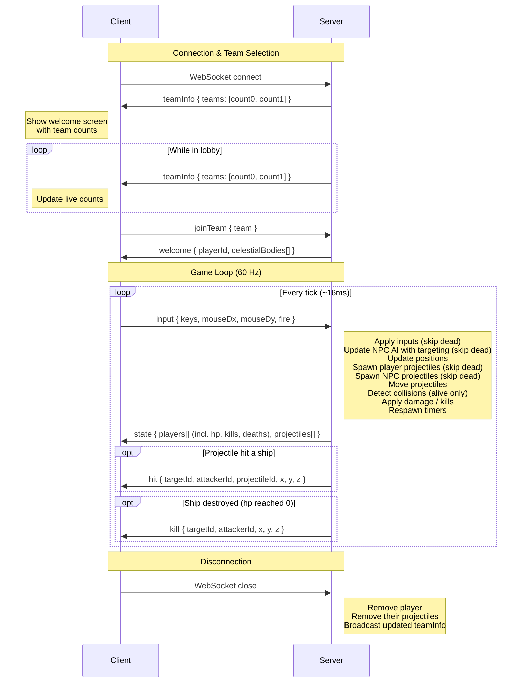

# X-Drift

Online 3D space battle game set in a galaxy. Players pilot an X-wing-style ship in team deathmatch — Green vs Red — competing to outscore the enemy team. On the welcome screen, players choose which team to join while seeing live member counts.

## Tech Stack

| Layer | Technology | Purpose |
|-------|-----------|---------|
| Rendering | Three.js | 3D graphics in the browser |
| Client bundler | Vite | Dev server with HMR, TypeScript support |
| Server runtime | Node.js + tsx | Game server with hot reload in dev |
| WebSocket | ws (server) / native WebSocket (client) | Real-time bidirectional communication |
| Language | TypeScript | Shared types across client and server |
| Testing | Vitest | Server-side unit tests |
| Package management | npm workspaces | Monorepo with shared dependencies |

## Repository Structure

```
x-drift/
├── package.json           # Workspace root
├── tsconfig.base.json     # Shared TypeScript config
├── client/                # Browser client (Vite + Three.js)
│   ├── index.html
│   ├── src/
│   │   ├── main.ts        # Three.js renderer + WebSocket client
│   │   ├── ship.ts        # Ship model factory (7-mesh X-wing shape)
│   │   ├── starfield.ts   # Particle-based starfield that follows the camera
│   │   ├── celestial.ts   # Sun and planet renderer from server data
│   │   ├── projectile.ts  # Projectile beam renderer (synced from server state)
│   │   ├── hitEffect.ts   # Hit flash + death explosion effects
│   │   ├── welcome.ts     # Welcome screen with team selection and live counts
│   │   ├── killFeed.ts    # DOM-based kill feed overlay (top-right)
│   │   └── scoreboard.ts  # Top-10 scoreboard overlay (top-left)

│   ├── package.json
│   └── tsconfig.json
├── server/                # Authoritative game server (Node.js + ws)
│   ├── src/
│   │   ├── index.ts       # WebSocket server + game loop
│   │   ├── game.ts        # Pure game logic (movement, projectiles, collisions, damage)
│   │   ├── npc.ts         # NPC ship AI (wander + combat behavior, input simulation)
│   │   └── __tests__/
│   │       ├── game.test.ts
│   │       └── npc.test.ts
│   ├── vitest.config.ts
│   ├── package.json
│   └── tsconfig.json
└── shared/                # Types and constants shared by client and server
    ├── src/
    │   └── index.ts       # Message types, game constants
    ├── package.json
    └── tsconfig.json
```

## Architecture

The game uses an **authoritative server** model to prevent cheating:

```
Client                             Server
──────                             ──────
Captures input (keyboard + mouse)
  → sends via WebSocket →          Receives input from all players
                                   Runs game loop (60 ticks/sec):
                                     - Applies player inputs
                                     - Updates NPC AI (simulates inputs)
                                     - Computes physics (positions, collisions)
                                     - Updates world state
  ← receives via WebSocket ←      Broadcasts state snapshot to each client
Renders state with Three.js
```

- The **client** only captures player input and renders the state received from the server.
- The **server** is the single source of truth. It processes all inputs, runs the physics simulation, and sends the resulting world state back to every connected client.

### Message Flow



## Getting Started

### Prerequisites

- Node.js >= 18
- npm >= 9

### Install

```bash
npm install
```

### Run in Development

Start the server and client in two separate terminals:

```bash
# Terminal 1 — Game server (ws://localhost:3000)
npm run dev --workspace=server

# Terminal 2 — Client dev server (http://localhost:5173)
npm run dev --workspace=client
```

Open `http://localhost:5173` in your browser. You can open multiple tabs to simulate multiple players.

### Run Tests

```bash
npm test --workspace=server
```

## Controls

| Input | Action |
|-------|--------|
| Click | Lock mouse pointer (enables look) |
| Mouse | Steer ship |
| W / Arrow Up | Accelerate forward (max 10 u/s) |
| S / Arrow Down | Brake (decelerate to 0, never reverses) |
| A / Arrow Left | Roll left |
| D / Arrow Right | Roll right |
| Left click (while locked) | Fire projectile (~3 shots/sec) |

Releasing W keeps the current speed (no friction). A debug bar at the top of the screen shows HP, position, and speed.

## Protocol

All messages are JSON over WebSocket.

### Client → Server

| Message | Fields | Description |
|---------|--------|-------------|
| `joinTeam` | `team` | Player picks a team from the welcome screen (0 = green, 1 = red) |
| `input` | `seq`, `keys`, `mouseDx`, `mouseDy`, `fire` | Currently pressed keys, accumulated mouse deltas, and fire intent |

### Server → Client

| Message | Fields | Description |
|---------|--------|-------------|
| `teamInfo` | `teams: [number, number]` | Live team member counts (players + NPCs); sent to lobby clients on connect and whenever counts change |
| `welcome` | `playerId`, `celestialBodies[]` | Sent after `joinTeam`, assigns a player ID and world geometry |
| `state` | `players[]` (incl. `hp`, `kills`, `deaths`, `team`), `projectiles[]` | World snapshot with all player/NPC positions, scores, and team |
| `hit` | `targetId`, `attackerId`, `projectileId`, `x`, `y`, `z` | A projectile hit a ship (triggers flash effect) |
| `kill` | `targetId`, `attackerId`, `x`, `y`, `z` | A ship was destroyed (triggers death explosion, kill feed, respawn) |

## Roadmap
- Nitro. You can press a button and get hyper speed for a few secons (to runaway from an enemy behind you). There's a huge cooldown so you don't use constantly
- Add a trail to the ships when they are moving (speed > 0)
- When ships clash they die automatically
- Players get named by numbers. They should have random names similar to Maverick and similar
- Move to 3d models (kenney assets)
- Client-side interpolation — Smooth movement between server snapshots so motion doesn't look choppy.
- Ship upgrades — As players score eliminations, their ship improves (speed, damage, etc.).
